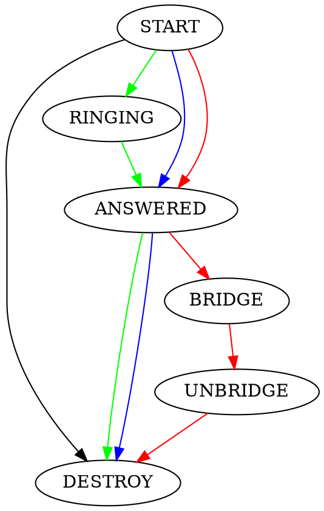
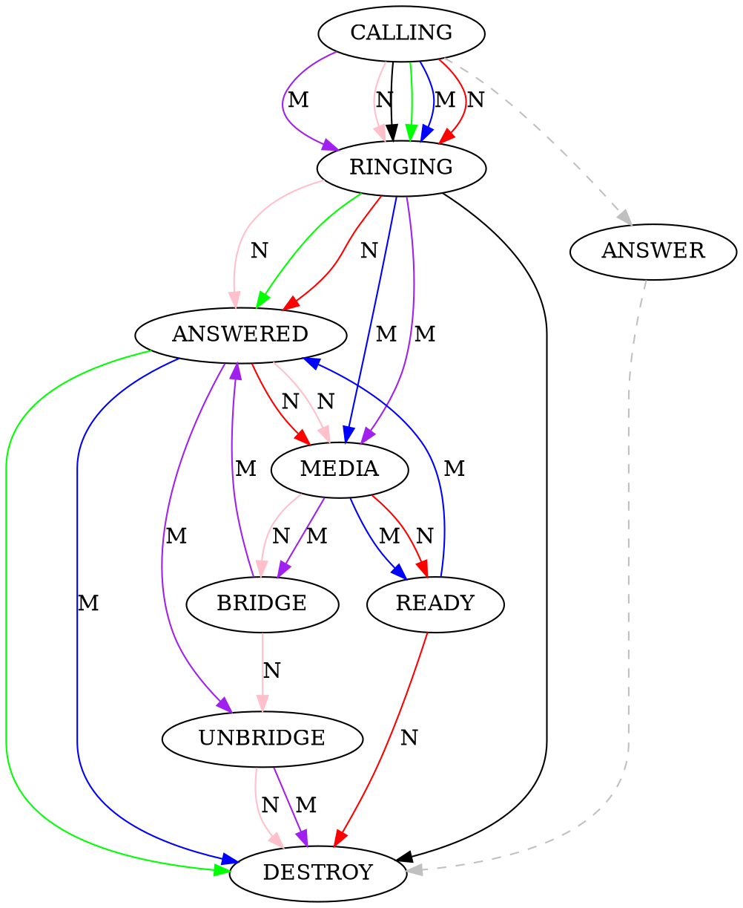

# XCC Core

Core提供XCC公共包。

目录结构

- xlog 日志
- expr 判断表达式
- ctrl 节点管理
- perm 权限控制
- proto 协议
- tboy 是一个冒牌的的FreeSWITCH，用于测试

# bus

`bus`是一个消息总线，相当于一个内部消息队列，支持Pub/Sub模式。

```go
bus.Subscribe("topic", "queue", func(ev *Event) error {
})

ev := NewEvent("Flag", "test-topic", "message", "data")
bus.Publish(ev)
```

`Publish`用于异步地往消息队列中发送一个消息。消息会发送到一个`chan`缓冲队列中，如果队列中未消费的消息达到最大值，`Publish`操作将会被阻塞。默认的最大值为：`inboundBufferSize = 10240000`。

`Subscribe`用于订阅一个主题（`toipc`），收到消息后会回调一个回调函数。如果`queue`参数为空字符串，则回调函数会在一个新的Go Routine中回调，因此可能无法保证顺序。

如果`queue`非空，则为对于每一个订阅者而言，每一个`queue`生成一个Go Routine，所有发送到该`queue`的消息将会被顺序调用，因此应该保证`queue`的粒度，在回调函数中不要过度阻塞。

`queue`的典型应用是针对在FreeSWITCH中的一路通话，每一个Channel UUID都可以作为一个独立的`queue`进行订阅，这样，即使消息回调函数发生阻塞，也只影响这一路通话。

如果Event的`Flag`参数为`DESTROY`，则Go Routine将会终止，并自动取消订阅。

## 过期

在异常情况下，可能由于收不到`DESTROY`相关的消息，导致Go Routine无法正常终止，相关的资源也无法释放。使用`SubscribeWithExpire`，可以在极端情况下保证资源释放。需要检查回调中的`Flag`是否为`TIMEOUT`，如：

```go
bus.SubscribeWithExpire("topic", "queue", time.Hour, func(ev *Event) error {
	if ev.Flag == "TIMEOUT" {
		bus.Unsubscribe("topic", "queue")
	}
})
```

## 多次订阅相同的`topic`和相同的`queue`

在实际生产中会有很多个订阅者同时订阅相同的`topic`和相同的`queue`，多个订阅者是竞争关系，即对于一个特定的消息，有且只有一个订阅者能接收到消息。这一点跟NATS的Queue订阅类似。

## 多次订阅相同的`topic`和不同的`queue`

多个订阅者订阅相同的`topic`和不同的`queue`，对于一条特定的消息，多个订阅者都能收到。跟NATS类似。

## 多次订阅不同的`topic`和相同的`queue`

在实际生产中会有很多个订阅者订阅不同的`topic`和相同的`queue`，`queue`之间没有必然的联系，因为订阅者首先是以Topic区分的。

# ctrl

`ctrl`是FreeSWITCH控制器，用于控制FreeSWITCH。它提供了一些函数方便与FreeSWITCH交互。

## ctrl.Init

初始化

```go
func Init(h Handler, trace bool, addrs string) error
```

* h是一个`ctrl.Handler`类型的结构，必须实现它定义的几个函数，下面会有详细描述。
* `trace`：是否开启内部Trace日志。
* `addrs`是NATS地址，可能可以支持多个以逗号分隔的地址，但未测试。

初始化后，内部会生成一个全局的`globalCtrl`单例，用于存储内部状态。

Handler是一个`interface`，必须实现如下几个函数（可以是空函数）。

```go
type Handler interface {
	// ctx , topic, reply,Params
	Request(context.Context, string, string, *Request)
	// ctx , topic ,reply  Params
	App(context.Context, string, string, *Message)
	// ctx , topic , Params
	Event(context.Context, string, *Request)
	// ctx , topic , Params
	Result(context.Context, string, *Result)
}
```

## ctrl.EnableRequest

```go
func EnableRequest(topic string) error
```

订阅Request请求消息。主要用于处理FreeSWITCH的请求，如`dialplan`、`directory`、`config`等。这种订阅总是异步处理的。

## ctrl.EnableApp

```go
func EnableApp(topic string) error
```

订阅一个`Topic`，是一个全能的订阅方式，包括接收Node的事件、返回结果等。

对于`Event.Channel`事件，回调函数里它将以当前的channel的uuid为topic和queue启用一个`bus`消息总线进行订阅处理，一方面避免nats回调端的阻塞，另一方面，
使channel在bus中成为一个串行的订阅。因而，对于同一个Channel UUID来说，回调是串行的，保证channel的START,RING,ANSWER,DESTROY等事件处理的有序性。

对于其它事件，它将使用新的Go Routine进行回调，因而，无法保证顺序。

## EnableEvent

```go
func EnableEvent(topic string, queue string) error
```

订阅事件相应的Topic，如`cn.xswitch.ctrl.cdr`。目前，除`cn.xswitch.ctrl.cdr`是在NATS中串行回调外，其它均为在新的Go Routine中回调。

## Subscribe

```go
func Subscribe(topic string, cb nats.EventCallback, queue string) (nats.Subscriber, error)
```

调用底层的NATS发起一个订阅。所有回调在同一个NATS Go Routine中回调。需要避免阻塞。

## 对Node中Channel的处理

Node侧为FreeSWITCH侧，订阅`cn.xswitch.node`以及`cn.xswitch.node.$node-uuid`。

Ctrl侧为控制侧，订阅`cn.xswitch.ctrl`及`cn.xswitch.ctrl.$ctrl-uuid`。

对于呼入，FreeSWITCH会发送`Event.Channel`消息，第一个消息是`state = START`，最后一个是`state = DESTROY`。

对于呼出，第一个消息是`state = CALLING`、最后一个是`state = DESTROY`。

只要Channel产生，都会产生`Event.CDR`事件。

### 同步处理机制

同步处理机制简单。系统通过`client`包，直接进行NATS同步调用。

收到`state = START`后，执行

```go
result, err := ctrl.Service().Accept(...)
ctrl.Service().Answer(...)
ctrl.Service().Play(...)
ctrl.Service().Hangup(...)
```

由于这些操作都是阻塞的，因而，要保证在一个新的Go Routine中运行，以避免阻塞消息的接收。

同步调用使用简单，但有个明显的不足，比如，`Play`是阻塞的，无法在当前的Go Routine中终止。如果需要提前终止一个长的`Play`操作，可以在其它的Go Routine中执行`Stop`，这通常需要需要外部的触发机制（如API），或提前启动一个Go Routine专门用于定时发`Stop`。

如果`Play`正常结束，会返回`code = 200`，如果被中止，通常会返回`code = 410`。有时候，对端主动挂机，也会导致`Play`提前终止。

可以通过检查Play的返回码，或者根据是否接收到`state = DESTROY`消息，或者主动发`XNode.GetState`接口向Node查询Channel的生存状态。

关于`err`的处理：

上述接口返回的`err`是一个`*errors.Error`类型（在`stack/`中实现），可以按如下方式处理：

```go
if err != nil {
	err1 := err.(*errors.Error)
	if err1.code == 500 {
	}
}
```

### 基于Context的同步处理机制

上述同步处理机制中，如果对端没有响应，则在超时前无法取消。可以使用Context进行超时设置或中途取消。

```go
ctx, cancel := context.WithTimeout(context.Background(), 1 * time.Second)
resullt, err := ctrl.AService().Play(ctx, ...)
defer cancel()
if err != nil {
		err1 := err.(*errors.Error)
	if err1.code == 408 {// timeout
	}
}
```

```go
ctx, cancel := context.WithTimeout(context.Background(), 1 * time.Second)
resullt, err := ctrl.AService().Play(ctx, ...)
go func() {
	// 100ms后cancel
	time.Sleep(100 * time.MilliSecond)
	cancel()
}
if err != nil {
	err1 := err.(*errors.Error)
	if err1.code == 499 {// canceled ...
	}
}
```

### 异步处理机制

有一个`ctrl.AsyncService()`可以发送异步的命令。如：

```go
ctrl.AsyncService().Play(...)
```

异步命令调用`nats.Publish`发送消息，会立即返回。除非NATS连接失败，结果永远会返回`code = 201`。

异步命令无法获取执行结果。

虽然有一个`ctrl.EnableResult`可用，但它独占一个订阅主题，实际上用处不大。

### ACall接口

该接口是一个试验接口。

另一种处理方式是不使用上述机制，通过独立的订阅支持ACall接口。

```go
ctrl.Subscribe("cn.xswitch.ctrl."+ctrl.UUID(), EventCallback, "ctrl")
```

订阅后，以在`EventCallback`回调中再调用`ctrl.DoResultCallback`处理结果：

```go
func EventCallback(ctx context.Context, ev nats.Event) error {
	xlog.Info(ev.Topic(), string(ev.Message().Body))

	var msg ctrl.Message
	err := json.Unmarshal(ev.Message().Body, &msg)

	if err != nil {
		xlog.Error("parse error", ev)
		return err
	}

	if msg.Method == "" { // maybe a result
		go ctrl.DoResultCallback(&msg)
		return nil
	}

	xlog.Error(msg.Method)

	switch msg.Method {
	case "Event.Channel":
    ...
```

由于该`EventCallback`是调用者自己实现的，因而可以自己选择是否在Go Routine中进行回调。

在调用时，可以通过`ctrl.ACallOption().WithCallback()`传入要回调的函数。

```go
	err := ctrl.ACall(node, "Dial",
		&xctrl.DialRequest{
			CtrlUuid: channel.CtrlUuid,
			Destination: &xctrl.Destination{
				GlobalParams: map[string]string{
					"ignore_early_media": "true",
				},
				CallParams: []*xctrl.CallParam{
					{
						Uuid:       channel.Uuid,
						CidName:    "TEST",
						CidNumber:  "test",
						DestNumber: "1008",
						DialString: "sofia/public/10000210@rts.xswitch.cn:20003",
						Params: map[string]string{
							"absolute_codec_string": "PCMA,PCMU",
						},
					},
				},
			},
		},
		ctrl.ACallOption().WithCallback(func(msg *ctrl.Message, data interface{}) {
			xlog.Info(string(*msg.Result))
			r := &xctrl.DialResponse{}
			err := json.Unmarshal(*msg.Result, &r)

			if err != nil {
				xlog.Error(err)
			}

			xlog.Info(r.Cause)
		}),
	)
```

实际使用时，建议使用上面介绍的`bus`队列机制对同一个Channel UUID相关的消息分流到独立的Go Routine中，这样，可以更好的控制生命周期。

### Channel的生命周期

呼入



呼出，其中，M代表有媒体，N代表`ignore_early_media=true`的情况。



在调用`XNode.Dial`外呼的时候，在`ignore_early_media=false`（默认）的情况下，收到`MEDIA`就会触发READY事件。如果为`true`，则需要等到`ANSWERED`以后才会触发`READY`状态。不管什么情况，都需要在收到`READY`状态后才可以对Channel进行控制。

在执行`XNode.Bridge`时，没有`READY`事件，这时可以根据`ANSWERED`或`BRIDGE`事件处理业务逻辑。

在XNode中，一个Channel从创建开始（`state = START`或`state = CALLING`），到销毁（`state = DESTROY`），是一个完整的生命周期。销毁前，会发送`Event.CDR`事件，通常会在单独的Topic上发出（可配置）。

由于`Event.Channel`并不包含完整的数据（通道变量等），因而建议在Ctrl侧对Channel数据进行缓存。简单的缓存办法是直接根据Channel UUID放到一个`Map`中。由于Channel更新相对频繁，因而`sync.Map`可能不大适用，直接用`Map + sync.Mutex`可能更直接一些。

一般来说，只要Channel被创建，总会有对应的`DESTROY`消息。但是，在XNode发生崩溃的情况下，需要准备超时垃圾回收机制。

这样Ctrl的总体实现就会很复杂。

另一种实现思路是将Channel相关的状态都在XNode侧用通道变量保存。每次事件都带上全量的通道变量，这样Ctrl侧的逻辑实现就会简单一些，代价是会增加NATS消息吞吐量，因为大多数情况下，绝大部分的通道变量是无用的。全量的通道变量暂时还没有实现。

一种优化方案是根据实际的业务场景选择是否启用和传递哪些通道变量。暂时还没有实现。

## Context

Ctrl中的Context使用了标准的Go Context包，目前没有太大用处，大部分可以直接传入`context.Background()`或`context.TODO()`。

## queueBufferSize
在订阅事件的时候会使用这个变量大小进行channel的初始化，1024容量足够事件使用，太小会导致程序阻塞卡顿，影响运行效率。

## protobuf 扩展

在NativeJSAPI中，请求和返回的对象是多种多样的，因此定义一个单一的函数比较困难。我们在`xctrl`包中扩展了`XNativeJSRequest`和`XNativeJSResponse`以代替原来的`NatvieJSRequest`和`NativeJSResponse`。用法如下：

```go
req := &xctrl.XNativeJSRequest{
	CtrlUuid: CtrlUUID,
	Data: &xctrl.XNativeJSRequestData{
		Command: "sofia.status",
		Data: *ctrl.ToRawMessage(map[string]string{
			"profile": profile_name,
		}),
	},
}
response, err := ctrl.Service().NativeJSAPI(context.Background(), req, ctrl.WithAddress(""))
```

## 其它

目前，`EnableXXX`之类的都是在Queue方式订阅的，没有考虑到多Ctrl的情况。有待进一步设计。

更多文档参见[proto/doc](proto/doc)。
