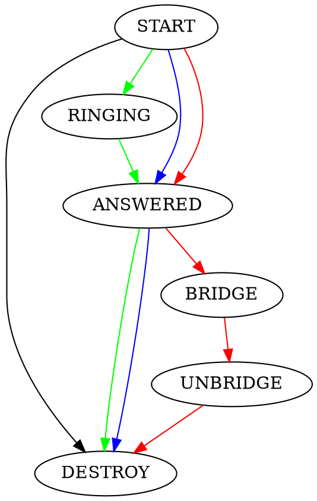
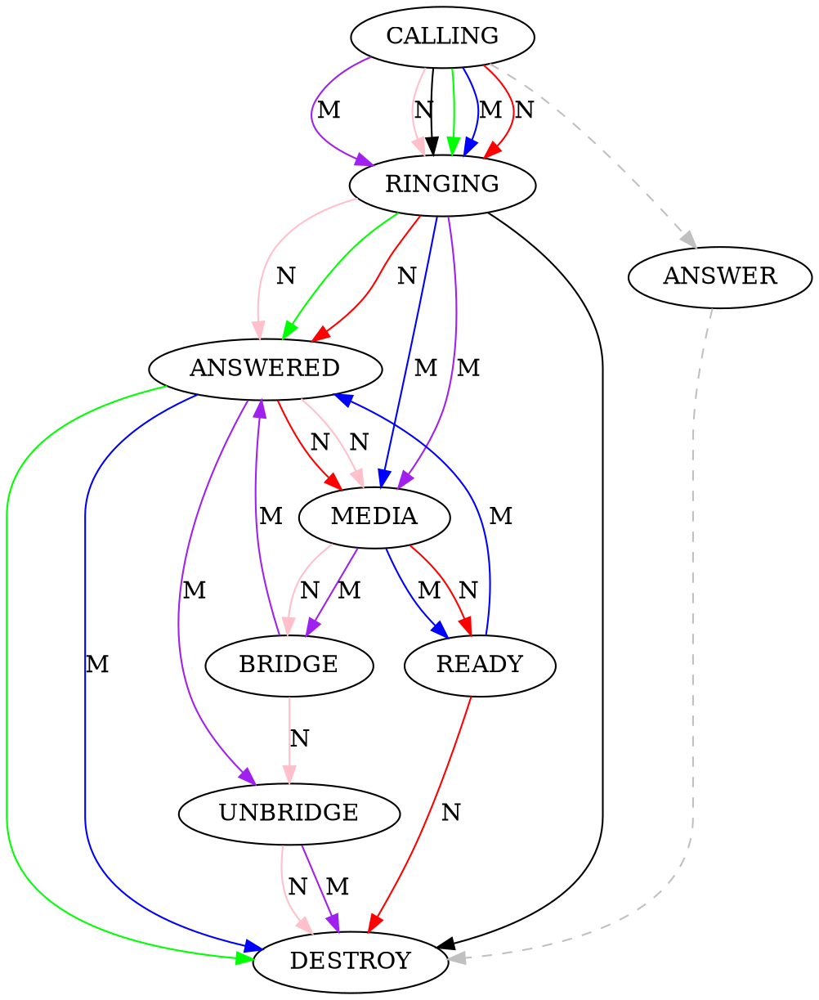

# 对Node中Channel的处理

Node侧为FreeSWITCH侧，订阅`cn.xswitch.node`以及`cn.xswitch.node.$node-uuid`。

Ctrl侧为控制侧，订阅`cn.xswitch.ctrl`及`cn.xswitch.ctrl.$ctrl-uuid`。

对于呼入，FreeSWITCH会发送`Event.Channel`消息，第一个消息是`state = START`，最后一个是`state = DESTROY`。

对于呼出，第一个消息是`state = CALLING`、最后一个是`state = DESTROY`。

只要Channel产生，都会产生`Event.CDR`事件。

## 同步处理机制

同步处理机制简单。系统通过`client`包，直接进行NATS同步调用。

收到`state = START`后，执行

```go
result, err := ctrl.Service().Accept(...)
ctrl.Service().Answer(...)
ctrl.Service().Play(...)
ctrl.Service().Hangup(...)
```

由于这些操作都是阻塞的，因而，要保证在一个新的Go Routine中运行，以避免阻塞消息的接收。

同步调用使用简单，但有个明显的不足，比如，`Play`是阻塞的，无法在当前的Go Routine中终止。如果需要提前终止一个长的`Play`操作，可以在其它的Go Routine中执行`Stop`，这通常需要需要外部的触发机制（如API），或提前启动一个Go Routine专门用于定时发`Stop`。

如果`Play`正常结束，会返回`code = 200`，如果被中止，通常会返回`code = 410`。有时候，对端主动挂机，也会导致`Play`提前终止。

可以通过检查Play的返回码，或者根据是否接收到`state = DESTROY`消息，或者主动发`XNode.GetState`接口向Node查询Channel的生存状态。

关于`err`的处理：

上述接口返回的`err`是一个`*errors.Error`类型（在`stack/`中实现），可以按如下方式处理：

```go
if err != nil {
	err1 := err.(*errors.Error)
	if err1.code == 500 {
	}
}
```

## 基于Context的同步处理机制

上述同步处理机制中，如果对端没有响应，则在超时前无法取消。可以使用Context进行超时设置或中途取消。

```go
ctx, cancel := context.WithTimeout(context.Background(), 1 * time.Second)
resullt, err := ctrl.AService().Play(ctx, ...)
defer cancel()
if err != nil {
	err1 := err.(*errors.Error)
	if err1.code == 408 {// timeout
	}
}
```

```go
ctx, cancel := context.WithTimeout(context.Background(), 1 * time.Second)
go func() {
	// 100ms后cancel
	time.Sleep(100 * time.MilliSecond)
	cancel()
}
resullt, err := ctrl.AService().Play(ctx, ...)
if err != nil {
	err1 := err.(*errors.Error)
	if err1.code == 499 {// canceled ...
	}
}
```

## 异步处理机制

有一个`ctrl.AsyncService()`可以发送异步的命令。如：

```go
ctrl.AsyncService().Play(...)
```

异步命令调用`nats.Publish`发送消息，会立即返回。除非NATS连接失败，结果永远会返回`code = 201`。

异步命令无法获取执行结果。

虽然有一个`ctrl.EnableResult`可用，但它独占一个订阅主题，实际上用处不大。

## ACall接口

该接口是一个试验接口。

另一种处理方式是不使用上述机制，通过独立的订阅支持ACall接口。

```go
ctrl.Subscribe("cn.xswitch.ctrl."+ctrl.UUID(), EventCallback, "ctrl")
```

订阅后，以在`EventCallback`回调中再调用`ctrl.DoResultCallback`处理结果：

```go
func EventCallback(ctx context.Context, ev nats.Event) error {
	xlog.Info(ev.Topic(), string(ev.Message().Body))

	var msg ctrl.Message
	err := json.Unmarshal(ev.Message().Body, &msg)

	if err != nil {
		xlog.Error("parse error", ev)
		return err
	}

	if msg.Method == "" { // maybe a result
		go ctrl.DoResultCallback(&msg)
		return nil
	}

	xlog.Error(msg.Method)

	switch msg.Method {
	case "Event.Channel":
    ...
```

由于该`EventCallback`是调用者自己实现的，因而可以自己选择是否在Go Routine中进行回调。

在调用时，可以通过`ctrl.ACallOption().WithCallback()`传入要回调的函数。

```go
	err := ctrl.ACall(node, "Dial",
		&xctrl.DialRequest{
			CtrlUuid: channel.CtrlUuid,
			Destination: &xctrl.Destination{
				GlobalParams: map[string]string{
					"ignore_early_media": "true",
				},
				CallParams: []*xctrl.CallParam{
					{
						Uuid:       channel.Uuid,
						CidName:    "TEST",
						CidNumber:  "test",
						DestNumber: "1008",
						DialString: "sofia/public/10000210@rts.xswitch.cn:20003",
						Params: map[string]string{
							"absolute_codec_string": "PCMA,PCMU",
						},
					},
				},
			},
		},
		ctrl.ACallOption().WithCallback(func(msg *ctrl.Message, data interface{}) {
			xlog.Info(string(*msg.Result))
			r := &xctrl.DialResponse{}
			err := json.Unmarshal(*msg.Result, &r)

			if err != nil {
				xlog.Error(err)
			}

			xlog.Info(r.Cause)
		}),
	)
```

实际使用时，建议使用上面介绍的`bus`队列机制对同一个Channel UUID相关的消息分流到独立的Go Routine中，这样，可以更好的控制生命周期。

## Channel的生命周期

呼入



呼出，其中，M代表有媒体，N代表`ignore_early_media=true`的情况。



在调用`XNode.Dial`外呼的时候，在`ignore_early_media=false`（默认）的情况下，收到`MEDIA`就会触发READY事件。如果为`true`，则需要等到`ANSWERED`以后才会触发`READY`状态。不管什么情况，都需要在收到`READY`状态后才可以对Channel进行控制。

在执行`XNode.Bridge`时，没有`READY`事件，这时可以根据`ANSWERED`或`BRIDGE`事件处理业务逻辑。

在XNode中，一个Channel从创建开始（`state = START`或`state = CALLING`），到销毁（`state = DESTROY`），是一个完整的生命周期。销毁前，会发送`Event.CDR`事件，通常会在单独的Topic上发出（可配置）。

由于`Event.Channel`并不包含完整的数据（通道变量等），因而建议在Ctrl侧对Channel数据进行缓存。简单的缓存办法是直接根据Channel UUID放到一个`Map`中。由于Channel更新相对频繁，因而`sync.Map`可能不大适用，直接用`Map + sync.Mutex`可能更直接一些。

一般来说，只要Channel被创建，总会有对应的`DESTROY`消息。但是，在XNode发生崩溃的情况下，需要准备超时垃圾回收机制。

这样Ctrl的总体实现就会很复杂。

另一种实现思路是将Channel相关的状态都在XNode侧用通道变量保存。每次事件都带上全量的通道变量，这样Ctrl侧的逻辑实现就会简单一些，代价是会增加NATS消息吞吐量，因为大多数情况下，绝大部分的通道变量是无用的。全量的通道变量暂时还没有实现。

一种优化方案是根据实际的业务场景选择是否启用和传递哪些通道变量。暂时还没有实现。

## channel相关函数

针对收到的`Event.Channel`事件，系统会自动转换为`ChannelEvent`对象，并为期自动生成了一些函数，方便调用。

`ctrl.Channel`是对`ChannelEvent`的封装，也可以继续`ChannelEvent`对象的函数。

更多channel相关的函数可以参阅[sdk.md](sdk.md)中的相关说明。

## channel处理流程

以来话为例，简单处理流程如下：

初始化ctrl，并订阅`Event.Channel`事件

```go

type MyAppHandler struct{}

func (h *MyAppHandler) ChannelEvent(context.Context, *Channel) {}
func (h *MyAppHandler) Event(*Message, nats.Event)             {}


ctrl.Init(false, "nats://127.0.0.1:4222")
ctrl.EnableApp(new Handler, "cn.xswitch.ctrl", "q")
```

当有来话时，将会回调`ChannelEvent`：

```go
func (h *MyAppHandler) ChannelEvent(context.Context, *Channel) {
	switch channel.GetState {
	case "START":
		{
			channel.Answer0()
		}
	case "ANSWERD":
		{
			channel.Play0("/tmp/welcome.wav")
			channel.Play0("/tmp/welcome1.wav")
			channel.Play0("/tmp/welcome2.wav")
			channel.Play0("/tmp/welcome3.wav")
		}
	}
	case "DESTROY":
		{
			// do something
		}
	}
}
```

注意，`channel.Play0()`是阻塞的，在它执行过程中，后续的事件回调将会被阻塞，直到播放完成。不过由于整个ChannelEvent都是在一个Go Routine中回调执行的，不会阻塞其他通话。
